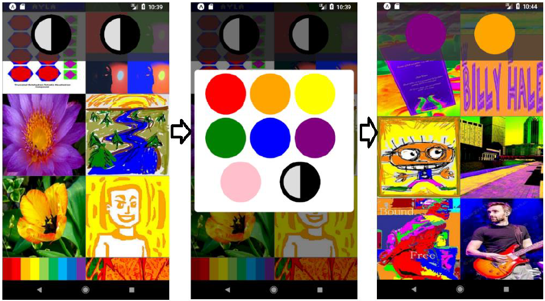

# hci-album-demo

React Native album application with special image filtering based on dominant colors

## Getting started

* install expo-cli globally `npm install -g expo-cli`
* run `npm install` to install all dependencies
* run `npm start` to start the application
* download the expo app on your mobile device and follow the instructions that appear on your browser
